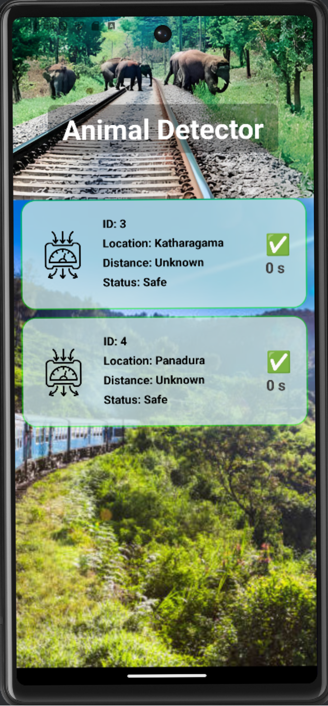

# Mobile App

This folder contains the source code for the mobile app. The app provides an interface for users to monitor and control the system remotely.


## View



## Overview

The mobile app is responsible for:

- Displaying areas status and distance to area.

The mobile app is built using **React Native**, which allows for building cross-platform applications.

## Features
- **See warning from specific areas:** 

## Setup

### 1. Install Dependencies

Before you can run the app, you'll need to install the necessary dependencies:

1. Make sure you have **Node.js** installed. You can download it from [here](https://nodejs.org/).
2. Install **React Native CLI** by running the following command in your terminal:

    ```bash
    npm install -g react-native-cli
    ```

3. Install the required dependencies for the mobile app:

    ```bash
    npm install
    ```

### 2. Configuring the Server IP
To configure the server IP for the mobile app, you'll need to set the values in the `App.js` file. Follow the steps below:

- Open the [`App.js`](./ArduinoApp/App.js) file in your project.
- Update the `SERVER` constant with the IP address of the [`Flask server`](../HttpServer/):
    ```javascript 
    const SERVER = "http://xxx.xxx.xxx.xxx";  // Replace with your server IP address
    ```
- The PORT_ADDRESS should also be configured to match the port the Flask server is running on:\
    ```javascript
    const PORT_ADDRESS = ':5000';  // Default Flask port
    ```
- Make sure your server and mobile device (or emulator) are on the same Wi-Fi network to establish communication.
  
After these changes, the mobile app will communicate with the server using the provided IP address and port

### 3. Running the App

To run the app on your local machine, you can use the following command:

- **For Android**:

    Make sure you have Android Studio and an emulator set up. Then, run:

    ```bash
    react-native run-android
    ```

- **For iOS**:

    If you're on macOS, you can run the app on an iOS simulator by using:

    ```bash
    react-native run-ios
    ```