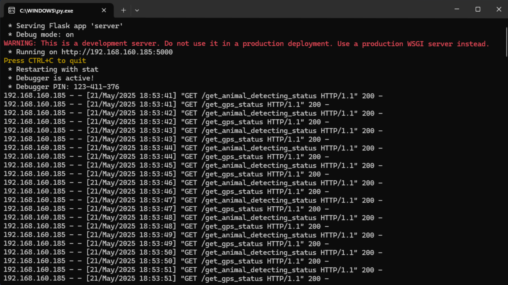

# Animal Detection and Train GPS Tracking System

A Flask-based server application for monitoring animal detection devices and train GPS locations to help prevent wildlife-train collisions.


## View



## Overview

This system consists of a server that receives and manages data from two types of IoT devices:
1. **Animal Detector Devices** - Detect animal presence near railway tracks
2. **Train GPS Devices** - Track the real-time location of trains

The server provides APIs to update device statuses and retrieve information about all devices in the system.

## Features

- Real-time tracking of train locations via GPS
- Animal detection monitoring near railway lines
- RESTful API for device status updates and data retrieval
- Cross-origin resource sharing (CORS) support

## Project Structure

```
├── server.py              # Main Flask server application
├── AnimalDetectorDevice.py # Animal detector device class
└── TrainGpsDevice.py      # Train GPS device class
```

## Requirements

- Python 3.6+
- Flask
- Flask-CORS

## Installation

1. Clone this repository:
   ```bash
   git clone https://github.com/thisal-d/nature-safe-rail.git
   cd nature-safe-rail
   ```

2. Install dependencies:
   ```bash
   pip install flask flask-cors
   ```

## Configuration

Edit the server configuration in `server.py`:

```python
# CONFIGURE SERVER IP ADDRESS and PORT ADDRESS
IP_ADDRESS = "192.168.160.185"  # Change to your server IP
PORT = 5000                     # Change port if needed
```

## Running the Server

Start the server with:

```bash
python server.py
```

The server will run on the configured IP address and port with debug mode enabled.

## API Endpoints

### Animal Detector Devices

#### Update Animal Detector Status
- **URL**: `/update_animal_detector_device_status`
- **Method**: `POST`
- **Data Parameters**:
  ```json
  {
    "device_id": "3",
    "is_animal_detected": "1",
    "latitude": "6.4169744",
    "longitude": "81.3353611",
    "location": "Katharagama",
    "active_time": "120"
  }
  ```
- **Success Response**: `{"message": "Status updated successfully"}`

#### Get All Animal Detector Statuses
- **URL**: `/get_animal_detecting_status`
- **Method**: `GET`
- **Success Response**:
  ```json
  [
    {
      "device_id": 3,
      "latitude": 6.4169744,
      "longitude": 81.3353611,
      "location": "Katharagama",
      "is_animal_detected": true,
      "is_active": true,
      "active_time": 120
    },
    ...
  ]
  ```

### Train GPS Devices

#### Update Train GPS Status
- **URL**: `/update_train_gps_device_status`
- **Method**: `POST`
- **Data Parameters**:
  ```json
  {
    "device_id": "1",
    "latitude": "6.9271",
    "longitude": "79.8612"
  }
  ```
- **Success Response**: `{"message": "Status updated successfully"}`

#### Get All Train GPS Statuses
- **URL**: `/get_gps_status`
- **Method**: `GET`
- **Success Response**:
  ```json
  [
    {
      "device_id": 1,
      "latitude": 6.9271,
      "longitude": 79.8612
    },
    ...
  ]
  ```

## Device Classes

### AnimalDetectorDevice

Represents a device that detects animal presence near railway tracks.

Properties:
- `device_id`: Unique identifier for the device
- `latitude`: Current latitude coordinate
- `longitude`: Current longitude coordinate
- `location`: Named location of the device
- `is_animal_detected`: Boolean indicating if an animal is detected
- `is_active`: Boolean indicating if the device is operational
- `active_time`: Time the device has been active (in seconds)

### TrainGpsDevice

Represents a GPS tracking device mounted on a train.

Properties:
- `device_id`: Unique identifier for the device
- `latitude`: Current latitude coordinate of the train
- `longitude`: Current longitude coordinate of the train

## License

[MIT](LICENSE)

## Contributing

1. Fork the project
2. Create your feature branch (`git checkout -b feature/amazing-feature`)
3. Commit your changes (`git commit -m 'Add some amazing feature'`)
4. Push to the branch (`git push origin feature/amazing-feature`)
5. Open a Pull Request
